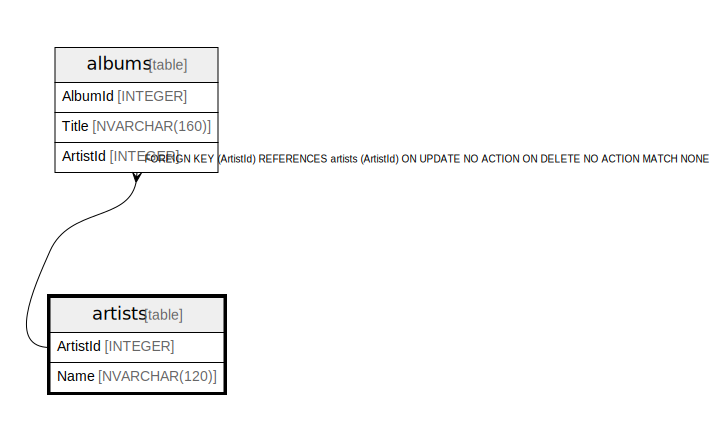

# artists

## Description

<details>
<summary><strong>Table Definition</strong></summary>

```sql
CREATE TABLE "artists"
(
    [ArtistId] INTEGER PRIMARY KEY AUTOINCREMENT NOT NULL,
    [Name] NVARCHAR(120)
)
```

</details>

## Columns

| Name | Type | Default | Nullable | Children | Parents | Comment |
| ---- | ---- | ------- | -------- | -------- | ------- | ------- |
| ArtistId | INTEGER |  | false | [albums](albums.md) |  |  |
| Name | NVARCHAR(120) |  | true |  |  |  |

## Constraints

| Name | Type | Definition |
| ---- | ---- | ---------- |
| ArtistId | PRIMARY KEY | PRIMARY KEY (ArtistId) |

## Relations



---

> Generated by [tbls](https://github.com/k1LoW/tbls)
