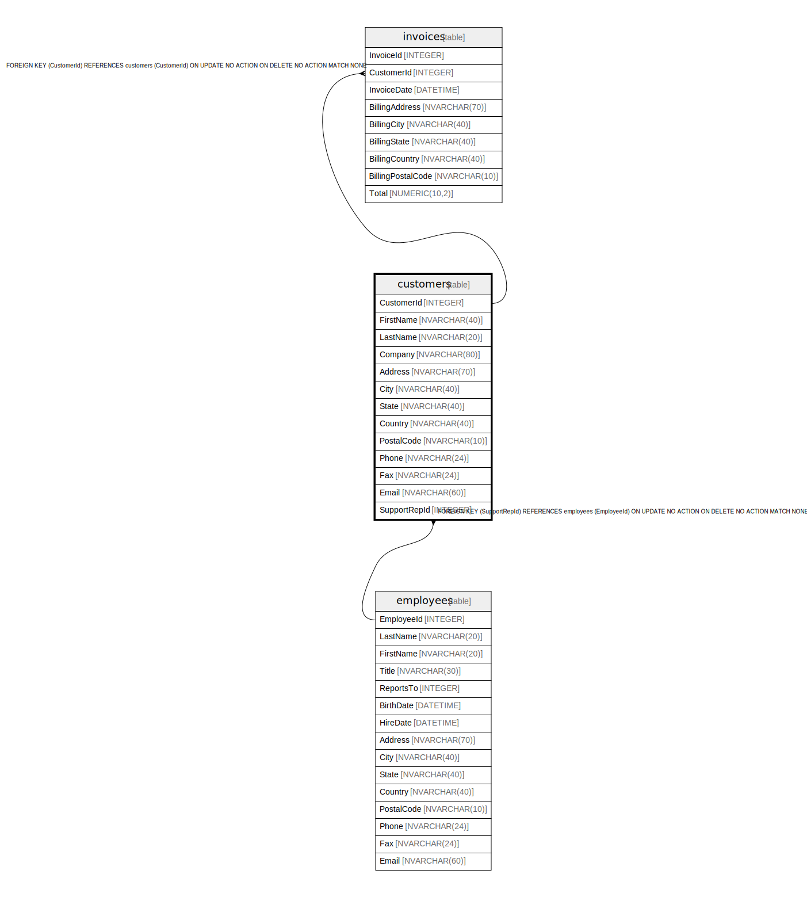

# customers

## Description

<details>
<summary><strong>Table Definition</strong></summary>

```sql
CREATE TABLE "customers"
(
    [CustomerId] INTEGER PRIMARY KEY AUTOINCREMENT NOT NULL,
    [FirstName] NVARCHAR(40)  NOT NULL,
    [LastName] NVARCHAR(20)  NOT NULL,
    [Company] NVARCHAR(80),
    [Address] NVARCHAR(70),
    [City] NVARCHAR(40),
    [State] NVARCHAR(40),
    [Country] NVARCHAR(40),
    [PostalCode] NVARCHAR(10),
    [Phone] NVARCHAR(24),
    [Fax] NVARCHAR(24),
    [Email] NVARCHAR(60)  NOT NULL,
    [SupportRepId] INTEGER,
    FOREIGN KEY ([SupportRepId]) REFERENCES "employees" ([EmployeeId]) 
		ON DELETE NO ACTION ON UPDATE NO ACTION
)
```

</details>

## Columns

| Name | Type | Default | Nullable | Children | Parents | Comment |
| ---- | ---- | ------- | -------- | -------- | ------- | ------- |
| CustomerId | INTEGER |  | false | [invoices](invoices.md) |  |  |
| FirstName | NVARCHAR(40) |  | false |  |  |  |
| LastName | NVARCHAR(20) |  | false |  |  |  |
| Company | NVARCHAR(80) |  | true |  |  |  |
| Address | NVARCHAR(70) |  | true |  |  |  |
| City | NVARCHAR(40) |  | true |  |  |  |
| State | NVARCHAR(40) |  | true |  |  |  |
| Country | NVARCHAR(40) |  | true |  |  |  |
| PostalCode | NVARCHAR(10) |  | true |  |  |  |
| Phone | NVARCHAR(24) |  | true |  |  |  |
| Fax | NVARCHAR(24) |  | true |  |  |  |
| Email | NVARCHAR(60) |  | false |  |  |  |
| SupportRepId | INTEGER |  | true |  | [employees](employees.md) |  |

## Constraints

| Name | Type | Definition |
| ---- | ---- | ---------- |
| CustomerId | PRIMARY KEY | PRIMARY KEY (CustomerId) |
| - (Foreign key ID: 0) | FOREIGN KEY | FOREIGN KEY (SupportRepId) REFERENCES employees (EmployeeId) ON UPDATE NO ACTION ON DELETE NO ACTION MATCH NONE |

## Indexes

| Name | Definition |
| ---- | ---------- |
| IFK_CustomerSupportRepId | CREATE INDEX [IFK_CustomerSupportRepId] ON "customers" ([SupportRepId]) |

## Relations



---

> Generated by [tbls](https://github.com/k1LoW/tbls)
