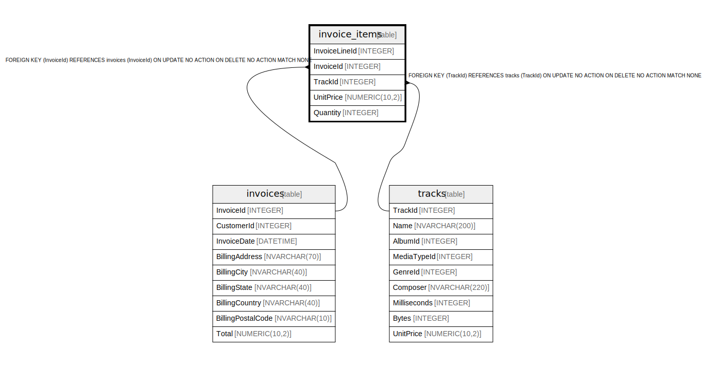

# invoice_items

## Description

<details>
<summary><strong>Table Definition</strong></summary>

```sql
CREATE TABLE "invoice_items"
(
    [InvoiceLineId] INTEGER PRIMARY KEY AUTOINCREMENT NOT NULL,
    [InvoiceId] INTEGER  NOT NULL,
    [TrackId] INTEGER  NOT NULL,
    [UnitPrice] NUMERIC(10,2)  NOT NULL,
    [Quantity] INTEGER  NOT NULL,
    FOREIGN KEY ([InvoiceId]) REFERENCES "invoices" ([InvoiceId]) 
		ON DELETE NO ACTION ON UPDATE NO ACTION,
    FOREIGN KEY ([TrackId]) REFERENCES "tracks" ([TrackId]) 
		ON DELETE NO ACTION ON UPDATE NO ACTION
)
```

</details>

## Columns

| Name | Type | Default | Nullable | Children | Parents | Comment |
| ---- | ---- | ------- | -------- | -------- | ------- | ------- |
| InvoiceLineId | INTEGER |  | false |  |  |  |
| InvoiceId | INTEGER |  | false |  | [invoices](invoices.md) |  |
| TrackId | INTEGER |  | false |  | [tracks](tracks.md) |  |
| UnitPrice | NUMERIC(10,2) |  | false |  |  |  |
| Quantity | INTEGER |  | false |  |  |  |

## Constraints

| Name | Type | Definition |
| ---- | ---- | ---------- |
| InvoiceLineId | PRIMARY KEY | PRIMARY KEY (InvoiceLineId) |
| - (Foreign key ID: 0) | FOREIGN KEY | FOREIGN KEY (TrackId) REFERENCES tracks (TrackId) ON UPDATE NO ACTION ON DELETE NO ACTION MATCH NONE |
| - (Foreign key ID: 1) | FOREIGN KEY | FOREIGN KEY (InvoiceId) REFERENCES invoices (InvoiceId) ON UPDATE NO ACTION ON DELETE NO ACTION MATCH NONE |

## Indexes

| Name | Definition |
| ---- | ---------- |
| IFK_InvoiceLineTrackId | CREATE INDEX [IFK_InvoiceLineTrackId] ON "invoice_items" ([TrackId]) |
| IFK_InvoiceLineInvoiceId | CREATE INDEX [IFK_InvoiceLineInvoiceId] ON "invoice_items" ([InvoiceId]) |

## Relations



---

> Generated by [tbls](https://github.com/k1LoW/tbls)
