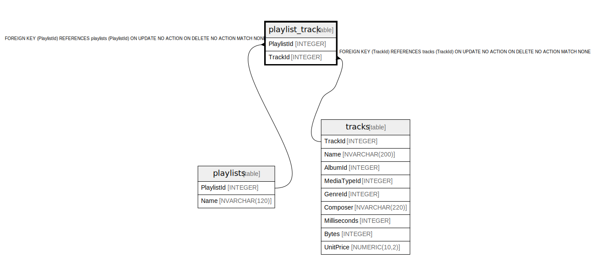

# playlist_track

## Description

<details>
<summary><strong>Table Definition</strong></summary>

```sql
CREATE TABLE "playlist_track"
(
    [PlaylistId] INTEGER  NOT NULL,
    [TrackId] INTEGER  NOT NULL,
    CONSTRAINT [PK_PlaylistTrack] PRIMARY KEY  ([PlaylistId], [TrackId]),
    FOREIGN KEY ([PlaylistId]) REFERENCES "playlists" ([PlaylistId]) 
		ON DELETE NO ACTION ON UPDATE NO ACTION,
    FOREIGN KEY ([TrackId]) REFERENCES "tracks" ([TrackId]) 
		ON DELETE NO ACTION ON UPDATE NO ACTION
)
```

</details>

## Columns

| Name | Type | Default | Nullable | Children | Parents | Comment |
| ---- | ---- | ------- | -------- | -------- | ------- | ------- |
| PlaylistId | INTEGER |  | false |  | [playlists](playlists.md) |  |
| TrackId | INTEGER |  | false |  | [tracks](tracks.md) |  |

## Constraints

| Name | Type | Definition |
| ---- | ---- | ---------- |
| PlaylistId | PRIMARY KEY | PRIMARY KEY (PlaylistId) |
| TrackId | PRIMARY KEY | PRIMARY KEY (TrackId) |
| - (Foreign key ID: 0) | FOREIGN KEY | FOREIGN KEY (TrackId) REFERENCES tracks (TrackId) ON UPDATE NO ACTION ON DELETE NO ACTION MATCH NONE |
| - (Foreign key ID: 1) | FOREIGN KEY | FOREIGN KEY (PlaylistId) REFERENCES playlists (PlaylistId) ON UPDATE NO ACTION ON DELETE NO ACTION MATCH NONE |
| sqlite_autoindex_playlist_track_1 | PRIMARY KEY | PRIMARY KEY (PlaylistId, TrackId) |

## Indexes

| Name | Definition |
| ---- | ---------- |
| IFK_PlaylistTrackTrackId | CREATE INDEX [IFK_PlaylistTrackTrackId] ON "playlist_track" ([TrackId]) |
| sqlite_autoindex_playlist_track_1 | PRIMARY KEY (PlaylistId, TrackId) |

## Relations



---

> Generated by [tbls](https://github.com/k1LoW/tbls)
