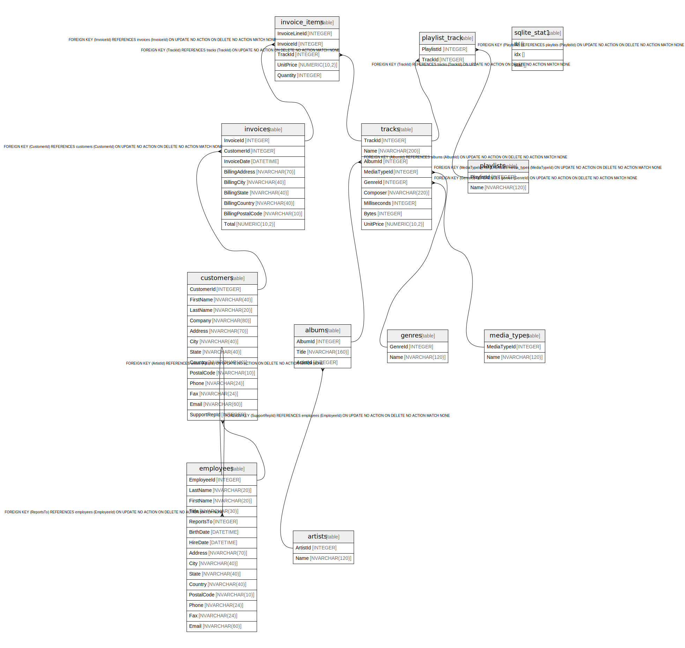

# chinook.db
This is what is published in　https://www.sqlitetutorial.net/sqlite-sample-database/
## Tables

| Name | Columns | Comment | Type |
| ---- | ------- | ------- | ---- |
| [albums](albums.md) | 3 |  | table |
| [artists](artists.md) | 2 |  | table |
| [customers](customers.md) | 13 |  | table |
| [employees](employees.md) | 15 |  | table |
| [genres](genres.md) | 2 |  | table |
| [invoices](invoices.md) | 9 |  | table |
| [invoice_items](invoice_items.md) | 5 |  | table |
| [media_types](media_types.md) | 2 |  | table |
| [playlists](playlists.md) | 2 |  | table |
| [playlist_track](playlist_track.md) | 2 |  | table |
| [tracks](tracks.md) | 9 |  | table |
| [sqlite_stat1](sqlite_stat1.md) | 3 |  | table |

## Relations

---

> Generated by [tbls](https://github.com/k1LoW/tbls)
