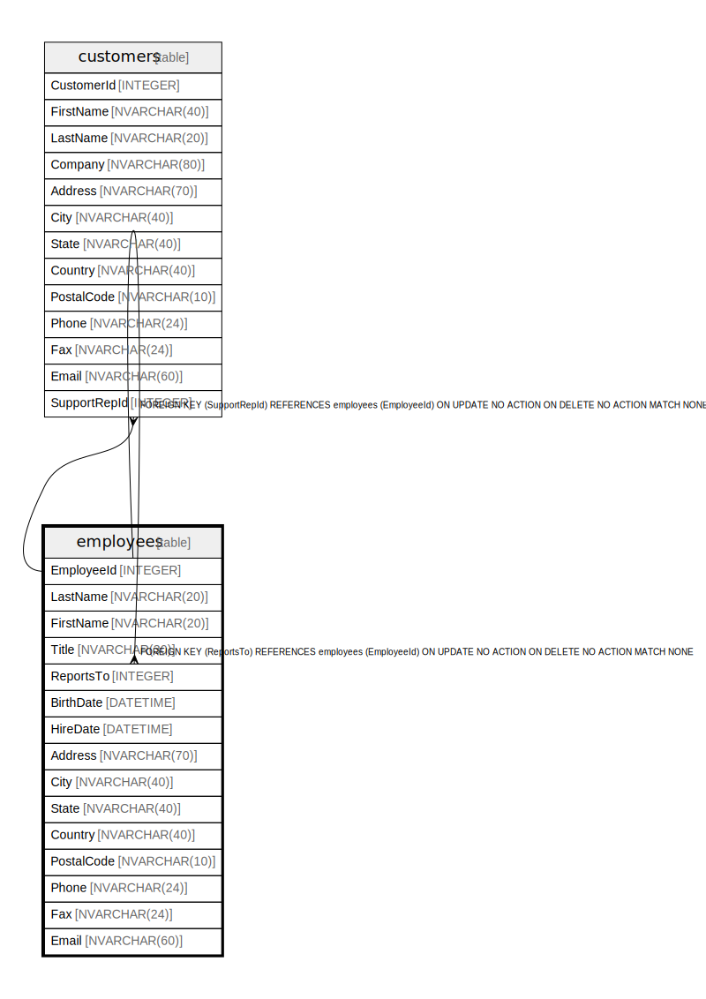

# employees

## Description

<details>
<summary><strong>Table Definition</strong></summary>

```sql
CREATE TABLE "employees"
(
    [EmployeeId] INTEGER PRIMARY KEY AUTOINCREMENT NOT NULL,
    [LastName] NVARCHAR(20)  NOT NULL,
    [FirstName] NVARCHAR(20)  NOT NULL,
    [Title] NVARCHAR(30),
    [ReportsTo] INTEGER,
    [BirthDate] DATETIME,
    [HireDate] DATETIME,
    [Address] NVARCHAR(70),
    [City] NVARCHAR(40),
    [State] NVARCHAR(40),
    [Country] NVARCHAR(40),
    [PostalCode] NVARCHAR(10),
    [Phone] NVARCHAR(24),
    [Fax] NVARCHAR(24),
    [Email] NVARCHAR(60),
    FOREIGN KEY ([ReportsTo]) REFERENCES "employees" ([EmployeeId]) 
		ON DELETE NO ACTION ON UPDATE NO ACTION
)
```

</details>

## Columns

| Name | Type | Default | Nullable | Children | Parents | Comment |
| ---- | ---- | ------- | -------- | -------- | ------- | ------- |
| EmployeeId | INTEGER |  | false | [customers](customers.md) [employees](employees.md) |  |  |
| LastName | NVARCHAR(20) |  | false |  |  |  |
| FirstName | NVARCHAR(20) |  | false |  |  |  |
| Title | NVARCHAR(30) |  | true |  |  |  |
| ReportsTo | INTEGER |  | true |  | [employees](employees.md) |  |
| BirthDate | DATETIME |  | true |  |  |  |
| HireDate | DATETIME |  | true |  |  |  |
| Address | NVARCHAR(70) |  | true |  |  |  |
| City | NVARCHAR(40) |  | true |  |  |  |
| State | NVARCHAR(40) |  | true |  |  |  |
| Country | NVARCHAR(40) |  | true |  |  |  |
| PostalCode | NVARCHAR(10) |  | true |  |  |  |
| Phone | NVARCHAR(24) |  | true |  |  |  |
| Fax | NVARCHAR(24) |  | true |  |  |  |
| Email | NVARCHAR(60) |  | true |  |  |  |

## Constraints

| Name | Type | Definition |
| ---- | ---- | ---------- |
| EmployeeId | PRIMARY KEY | PRIMARY KEY (EmployeeId) |
| - (Foreign key ID: 0) | FOREIGN KEY | FOREIGN KEY (ReportsTo) REFERENCES employees (EmployeeId) ON UPDATE NO ACTION ON DELETE NO ACTION MATCH NONE |

## Indexes

| Name | Definition |
| ---- | ---------- |
| IFK_EmployeeReportsTo | CREATE INDEX [IFK_EmployeeReportsTo] ON "employees" ([ReportsTo]) |

## Relations



---

> Generated by [tbls](https://github.com/k1LoW/tbls)
